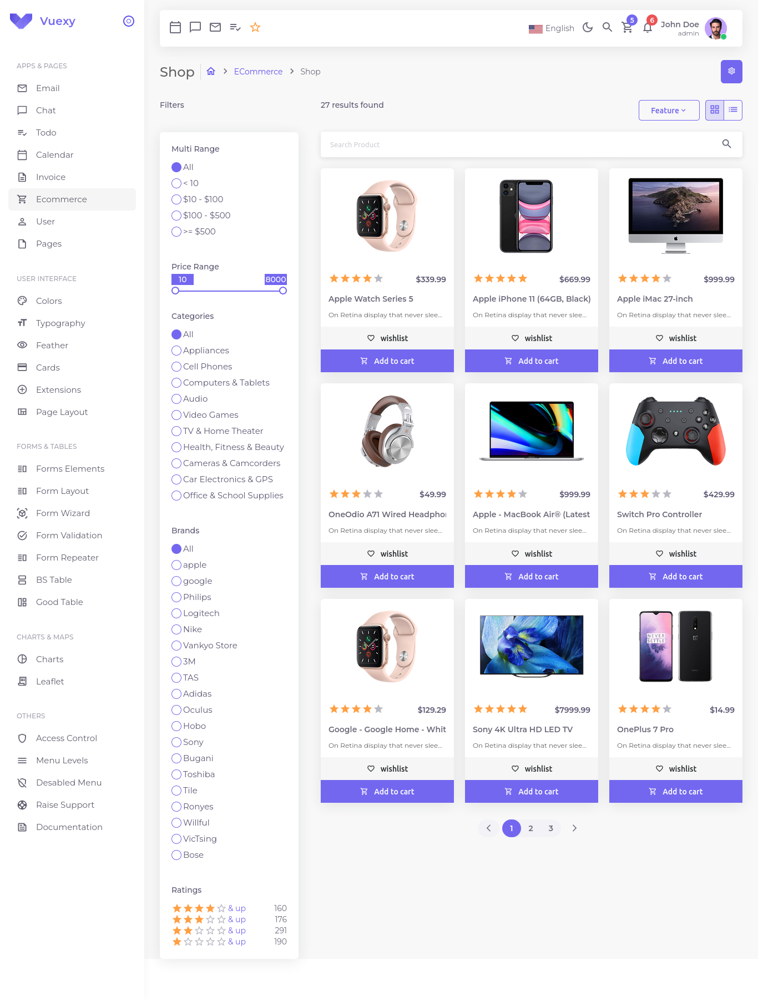
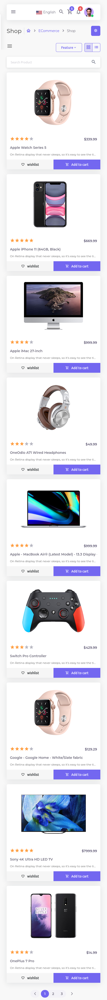

# react-shop
ecommerce shop highly interactive responsive user interface developed with ReactJs  
## Features
- Toggle Between Dark/Light Mode
- Responsive, looks very good in smaller screens
- Sort products from lower price to higher price and vice versa
- Toggle the display of products as you like whether grid view or list view
- Filter products by price
- Use price slider to get products match your needs
- Filter products by Category
- Filter Products by Brand
- Navigate between products using the pagination
## Screens
  
  

## setup and installation
1. npm install
2. npm start

